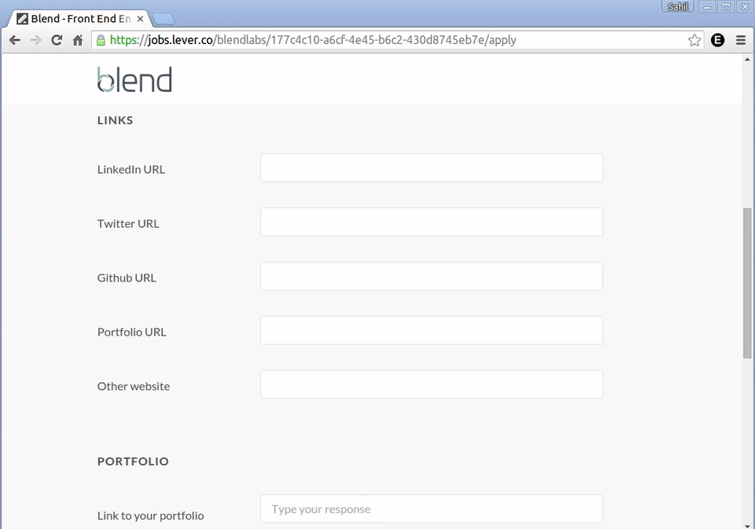
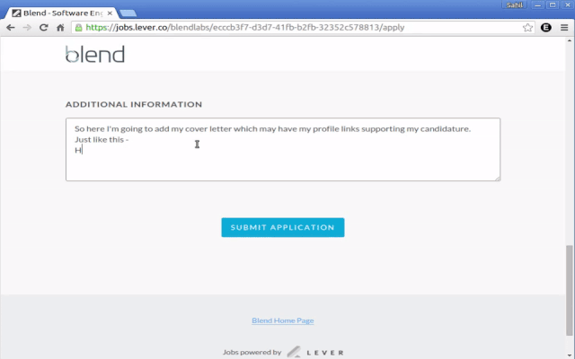
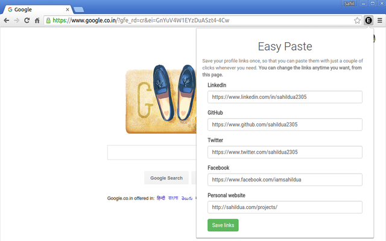
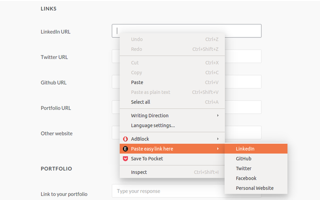
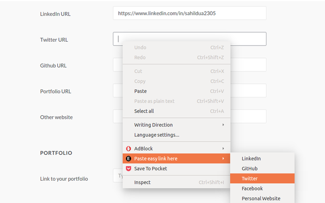
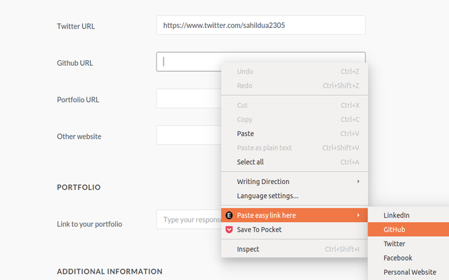

# Easy Paste

A chrome extension to keep all your frequently used profile links just a click away.

This Chrome extension helps you keep all your frequently used profile links handy. It lets you save these links and use them anywhere with just a click.

This extension will help you apply for jobs and create profiles in a jiffy. Just click and voila! you have the link by your side. It helps you get rid of the hassle of opening a new tab, reaching a particular URL and then copying it before the link can be put to some use.

Download this extension to skip this cumbersome process and jump onto the "put the link to use" part.

Happy easy-pasting!

Installation
------------

Or manually:

1. Download or `git clone http://github.com/sahildua2305/easy-paste-chrome.git`
2. Open Chrome extensions and click on the `Load unpacked extension` button
3. Select the downloaded directory

Demo
-----

####Easy-pasting in form input fields

####Easy-pasting in textarea field

Screenshots
-----------

####Saving your profile link when you install the extension for the first time

####Pasting your LinkedIn profile link using Easy Paste

####Pasting your Twitter profile link using Easy Paste

####Pasting your GitHub profile link using Easy Paste

